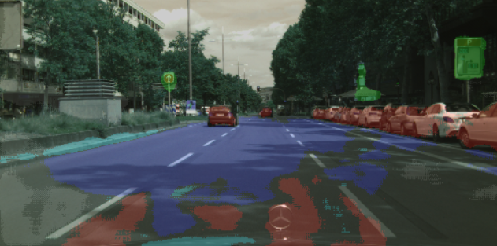

# UNet on the CityScapes Dataset

This project is fun side project to test how well UNet performs on Cityscapes Dataset which is large complex urban dataset.

UNet was original developed for biomedical application and architecture of model follows this paper.
[Original UNet Paper](https://arxiv.org/abs/1505.04597)

The Cityscape data can be found here. [Cityscape Data](https://www.cityscapes-dataset.com/)

### Cityscape Results

The following table represents the color overlay labels 

| Class Labels | Mask Color |
|:------------:|:----------:| 
|     void     |   black    | 
|     road     |    blue    | 
|   non-road   |   orange   |
| construction |    grey    |
| traffic sign |   green    |
|    human     | light-blue |
|   vehicle    |    red     |




Model need improvement, but can identity vehicles and traffic sign well.
The model seems to struggle with up close object, but does better with distant object.
For example blue, which represents road is identified better with distance.


### Project File Structure
    .
    ├── dataset                 # Cityscape dataset
        ├── camera              # Do not use
        ├── gtFine              # I only use Fine masks
        ├── leftImg8Bit         # Cityscape Images
        ├── vehicle             # Do not use
    ├── evaluate                # Cityscape demo videos
        ├── demoVideo
            ├── stuttgart_00    # Example City Folder
            ├── stuttgart_01
            ├── stuttgart_02
    ├── images                  # Test results
    ├── model                   # Collection of saved models
    ├── video                   # Exported videos
    ├── cityscapes-unet
        ├── evaluate.py
        ├── inference.py
        ├── loss.py
        ├── model.py
        ├── training.py
    ├── results.py
    ├── train.py
    ├── video.py
    └── README.md


### Training

Install the requirements.txt and run ```run.py``` to start training.

Training with arguments

```
python run.py -dataset "../Cityscape/dataset/" -model "saved_model_epoch49.pth" -hidden_layer 32 -image_resize "256, 512" -loss_function dice -optimizer adam -learning_rate 1e-4 -epochs 10 -batch_size 8 -model_save_folder "model"
```

### Generate Video

Using the ``` video.py``` you can generate ```.mp4``` and ```.avi``` file.

Download sample data from Cityscapes Website create folder and copy the data into the
project folder


### Todo
- [ ] Mask decoder is not working correctly
- [ ] Add arguments to training, video and result scripts
- [ ] Plot training losses and fix up precision and recall stats
- [ ] Clean up file structure and refactor code 
- [ ] Training the model longer over more iterations
- [ ] Look into better hyperparameter tunning methods
